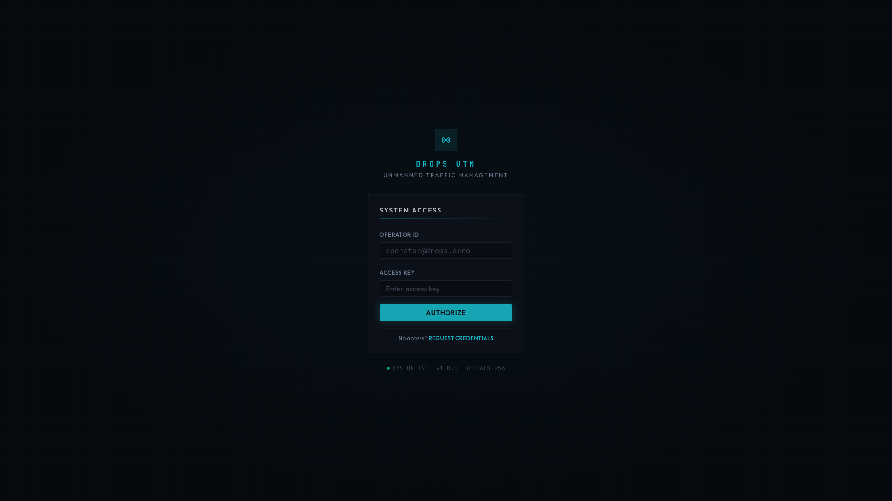
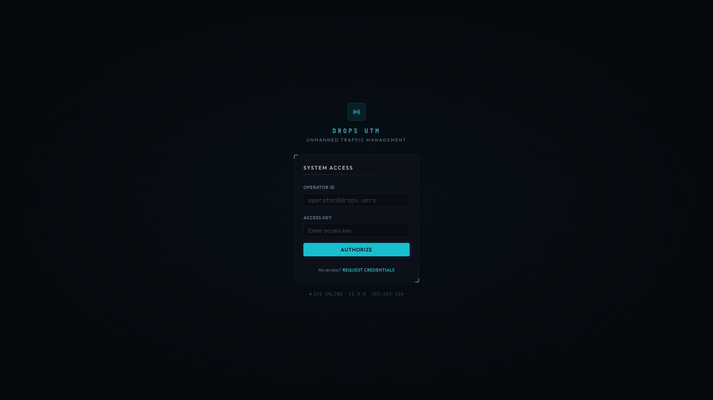

# DROPS UTM System
## User Manual

**Version 1.0**
**February 2026**

---

# Table of Contents

1. [Introduction](#1-introduction)
2. [Getting Started](#2-getting-started)
3. [User Roles & Permissions](#3-user-roles--permissions)
4. [Dashboard Overview](#4-dashboard-overview)
5. [Control Center](#5-control-center)
6. [Mission Planning](#6-mission-planning)
7. [Flight Management](#7-flight-management)
8. [Drone Fleet Management](#8-drone-fleet-management)
9. [Hub Management](#9-hub-management)
10. [Airspace Management](#10-airspace-management)
11. [Emergency Response](#11-emergency-response)
12. [Fleet Orchestration](#12-fleet-orchestration)
13. [Connectivity & Device Management](#13-connectivity--device-management)
14. [Weather Monitoring](#14-weather-monitoring)
15. [Conflict Detection](#15-conflict-detection)
16. [Settings & Configuration](#16-settings--configuration)
17. [Practical Examples](#17-practical-examples)
18. [Troubleshooting](#18-troubleshooting)
19. [Glossary](#19-glossary)

---

# 1. Introduction

## 1.1 What is DROPS UTM?

DROPS UTM (Unmanned Traffic Management) is a comprehensive drone fleet management system designed for organizations operating multiple drones across various locations. The system provides:

- **Real-time drone monitoring** with live telemetry
- **Mission planning** with waypoint-based routes
- **Automated emergency response** protocols
- **Fleet orchestration** for optimal resource allocation
- **Airspace management** with geofencing capabilities
- **Weather integration** for flight safety

## 1.2 System Requirements

- Modern web browser (Chrome, Firefox, Safari, Edge)
- Stable internet connection
- Screen resolution: 1280x720 minimum (1920x1080 recommended)

## 1.3 Accessing the System

Navigate to your organization's DROPS UTM URL (e.g., `https://utm.drops.eu`) and log in with your credentials.

---

# 2. Getting Started

## 2.1 Logging In

1. Open your web browser and navigate to the DROPS UTM URL
2. Enter your email address and password
3. Click **"Sign In"**


*Figure 2.1: DROPS UTM Login Screen*

## 2.2 First-Time Setup Checklist

For administrators setting up a new system:

| Step | Action | Required Role |
|------|--------|---------------|
| 1 | Create organization structure | Admin |
| 2 | Add hub locations | Admin |
| 3 | Register drones | Admin/Hub Operator |
| 4 | Define airspace zones | Admin/Hub Operator |
| 5 | Configure emergency protocols | Admin |
| 6 | Create user accounts | Admin |

## 2.3 Navigation

The sidebar on the left provides access to all system modules:

- **Dashboard** - System overview and statistics
- **Control Center** - Real-time drone monitoring
- **Emergency** - Emergency response management
- **Fleet** - Fleet orchestration settings
- **Connectivity** - Device connection management
- **Missions** - Mission planning and execution
- **Flights** - Flight operations management
- **Drones** - Drone fleet registry
- **Hubs** - Vertiport/hub management
- **Airspace** - Airspace zone configuration
- **Conflicts** - Conflict detection and resolution
- **Weather** - Weather monitoring
- **Settings** - System configuration (Admin only)

---

# 3. User Roles & Permissions

DROPS UTM implements role-based access control (RBAC) with three distinct roles:

## 3.1 Role Comparison Matrix

| Feature | Admin | Hub Operator | Pilot |
|---------|:-----:|:------------:|:-----:|
| **Dashboard** | ✓ Full | ✓ Full | ✓ Full |
| **Control Center** | ✓ Full | ✓ Full | ✓ Full |
| **Emergency Response** | ✓ Full | ✓ Full | ✓ View/Respond |
| **Fleet Orchestration** | ✓ Full | ✓ View | ✗ Hidden |
| **Connectivity** | ✓ Full | ✓ Register/Command | ✗ Hidden |
| **Missions** | ✓ All | ✓ All | ✓ Own |
| **Flights** | ✓ All | ✓ All | ✓ Own |
| **Drones - View** | ✓ | ✓ | ✓ |
| **Drones - Register** | ✓ | ✓ | ✗ |
| **Drones - Edit** | ✓ | ✓ | ✗ |
| **Drones - Delete** | ✓ | ✗ | ✗ |
| **Hubs - View** | ✓ | ✓ | ✓ |
| **Hubs - Create** | ✓ | ✗ | ✗ |
| **Hubs - Edit** | ✓ | ✓ | ✗ |
| **Hubs - Delete** | ✓ | ✗ | ✗ |
| **Airspace - View** | ✓ | ✓ | ✓ |
| **Airspace - Create** | ✓ | ✓ | ✗ |
| **Airspace - Delete** | ✓ | ✗ | ✗ |
| **Users Management** | ✓ | ✗ | ✗ |
| **Settings** | ✓ | ✗ | ✗ |

## 3.2 Admin Role

**Purpose**: Full system administration and oversight

**Responsibilities**:
- System configuration and maintenance
- User account management
- Hub creation and management
- Fleet-wide policy enforcement
- Emergency protocol configuration
- Audit and compliance monitoring

**Sidebar Access**: All menu items visible including Settings

**Best Practices**:
- Limit admin accounts to essential personnel
- Review audit logs regularly
- Maintain backup admin credentials securely

## 3.3 Hub Operator Role

**Purpose**: Day-to-day operations management at assigned hubs

**Responsibilities**:
- Drone registration and maintenance tracking
- Flight authorization and monitoring
- Mission planning and execution
- Emergency response coordination
- Device connectivity management

**Sidebar Access**: All items except Settings

**Best Practices**:
- Monitor drone health metrics daily
- Verify weather conditions before authorizing flights
- Maintain communication with pilots

## 3.4 Pilot Role

**Purpose**: Flight execution and mission completion

**Responsibilities**:
- Mission creation and execution
- Pre-flight checks
- Real-time flight monitoring
- Emergency response for assigned flights
- Flight documentation

**Sidebar Access**: Basic operations only (no Fleet, Connectivity, Settings)

**Best Practices**:
- Complete pre-flight checklists
- Monitor weather updates
- Report anomalies immediately

---

# 4. Dashboard Overview

The Dashboard provides a comprehensive system overview at a glance.


*Figure 4.1: Main Dashboard View*

## 4.1 Key Metrics

| Metric | Description |
|--------|-------------|
| **Active Drones** | Drones currently airborne |
| **Active Flights** | Ongoing flight operations |
| **Active Missions** | Missions in execution |
| **Pending Alerts** | Unacknowledged system alerts |

## 4.2 Quick Status Cards

- **Fleet Status**: Overview of all drones by operational status
- **Hub Status**: Status of all vertiports
- **Recent Flights**: Latest flight activities
- **Weather Summary**: Current conditions at primary hubs

## 4.3 Activity Feed

Real-time feed showing:
- Flight departures and arrivals
- Mission completions
- System alerts
- User activities

---

# 5. Control Center

The Control Center is the operational heart of DROPS UTM, providing real-time monitoring and control of all drone operations.


*Figure 5.1: Control Center with Map View*

## 5.1 Map View

The interactive map displays:
- **Drone positions** (real-time tracking)
- **Hub locations** (with status indicators)
- **Airspace zones** (color-coded by type)
- **Flight paths** (planned and actual)
- **Weather overlays** (optional)

### Map Controls

| Control | Function |
|---------|----------|
| Scroll | Zoom in/out |
| Click + Drag | Pan the map |
| Click Drone | Select and view details |
| Click Hub | View hub information |

## 5.2 Drone List Panel

Shows all registered drones with:
- Registration number
- Current status (idle, flying, charging, maintenance)
- Battery level
- Current location or assigned hub
- Active mission (if any)

### Status Indicators

| Color | Status |
|-------|--------|
| 🟢 Green | Operational/Flying |
| 🟡 Yellow | Idle/Standby |
| 🟠 Orange | Low Battery/Warning |
| 🔴 Red | Emergency/Offline |
| ⚪ Gray | Maintenance |

## 5.3 Telemetry Panel

When a drone is selected, view real-time telemetry:

- **Position**: Latitude, longitude, altitude
- **Speed**: Ground speed and vertical speed
- **Heading**: Current direction
- **Battery**: Percentage and estimated flight time
- **Signal**: Communication signal strength
- **Satellites**: GPS satellite count

## 5.4 Command Interface

Send commands to selected drones:

| Command | Description | Use Case |
|---------|-------------|----------|
| **RTH** | Return to Home | Recall drone to home hub |
| **LAND** | Land Immediately | Emergency landing at current position |
| **HOVER** | Hold Position | Pause and hover in place |
| **PAUSE** | Pause Mission | Temporarily stop mission execution |
| **RESUME** | Resume Mission | Continue paused mission |

---

# 6. Mission Planning


*Figure 6.1: Missions List View*

## 6.1 Creating a New Mission

1. Navigate to **Missions** → Click **"New Mission"**
2. Enter mission details:
   - **Mission Name**: Descriptive identifier
   - **Description**: Purpose and notes
   - **Departure Hub**: Starting location
   - **Arrival Hub**: Destination (can be same as departure)
   - **Assigned Drone**: Select from available drones

## 6.2 Waypoint Editor

### Adding Waypoints

1. Select **"Add Point"** mode in the toolbar
2. Click on the map to place waypoints
3. Waypoints are automatically connected in sequence

### Waypoint Properties

| Property | Description | Default |
|----------|-------------|---------|
| **Altitude** | Flight altitude in meters | 50m |
| **Speed** | Speed to this waypoint | 12 m/s |
| **Hover Duration** | Time to hover at waypoint | 0s |
| **Actions** | Actions to perform (photo, video, etc.) | None |

### Editing Waypoints

- **Move**: Drag waypoint marker on map
- **Edit**: Click waypoint, modify in side panel
- **Delete**: Select waypoint, click delete
- **Reorder**: Drag in waypoint list

## 6.3 Altitude Profile

The altitude profile chart shows:
- Planned altitude at each waypoint
- Terrain elevation (if available)
- Airspace ceiling limits

## 6.4 Mission Scheduling

| Schedule Type | Description |
|--------------|-------------|
| **Manual** | Start manually when ready |
| **Scheduled** | Automatic start at specified time |
| **Event Triggered** | Start based on external trigger |

## 6.5 Starting a Mission

**Prerequisites**:
- ✓ Drone assigned
- ✓ At least one waypoint defined
- ✓ Weather conditions acceptable
- ✓ Airspace clear

**Process**:
1. Review mission details
2. Click **"Start Mission"**
3. Confirm in dialog
4. Monitor progress in Control Center

---

# 7. Flight Management


*Figure 7.1: Flights Management View*

## 7.1 Flight vs Mission

| Concept | Description |
|---------|-------------|
| **Mission** | Pre-planned route with waypoints |
| **Flight** | Actual flight operation (may or may not follow a mission) |

## 7.2 Creating a Flight

1. Navigate to **Flights** → Click **"New Flight"**
2. Fill in flight details:
   - **Drone**: Select aircraft
   - **Departure Hub**: Origin
   - **Arrival Hub**: Destination
   - **Flight Type**: Cargo, Inspection, Survey, etc.
   - **Operation Mode**: Autonomous, Supervised, Manual
   - **Planned Departure**: Scheduled departure time

## 7.3 Flight Lifecycle

```
PLANNED → AUTHORIZED → ACTIVE → COMPLETED
                ↓           ↓
             CANCELLED   ABORTED
```

| Status | Description | Actions Available |
|--------|-------------|-------------------|
| **Planned** | Flight created, awaiting authorization | Edit, Authorize, Cancel |
| **Authorized** | Approved for operation | Start, Cancel |
| **Active** | Currently in progress | Monitor, Complete, Abort |
| **Completed** | Successfully finished | View logs |
| **Aborted** | Terminated early | View logs |
| **Cancelled** | Cancelled before start | - |

## 7.4 Flight Authorization

Flights require authorization before execution:

1. Review flight plan
2. Check weather conditions
3. Verify airspace availability
4. Click **"Authorize"**

## 7.5 Flight Monitoring

During active flights:
- Track position on map
- Monitor telemetry
- View estimated arrival time
- Receive alerts for anomalies

---

# 8. Drone Fleet Management


*Figure 8.1: Drone Fleet Registry*

## 8.1 Registering a New Drone

**Required Role**: Admin or Hub Operator

1. Navigate to **Drones** → Click **"Register Drone"**
2. Enter drone information:

| Field | Description | Example |
|-------|-------------|---------|
| **Registration Number** | Unique identifier | GR-DRN-001 |
| **Manufacturer** | Drone manufacturer | DJI |
| **Model** | Drone model | Matrice 300 RTK |
| **Serial Number** | Factory serial number | SN-ABC123456 |
| **Home Hub** | Assigned base location | Athens Central Hub |
| **Communication Protocol** | Connection protocol | MAVLink |

## 8.2 Drone Status Management

| Status | Meaning | Can Fly? |
|--------|---------|----------|
| **Idle** | Ready for operation | ✓ |
| **Flying** | Currently airborne | - |
| **Charging** | Battery charging | ✗ |
| **Maintenance** | Under maintenance | ✗ |
| **Offline** | No communication | ✗ |

## 8.3 Drone Health Monitoring

Monitor key health indicators:

- **Battery Health**: Capacity degradation over time
- **Flight Hours**: Total operational hours
- **Maintenance Due**: Scheduled maintenance date
- **Last Inspection**: Date of last inspection

## 8.4 Maintenance Scheduling

1. Select drone from list
2. Click **"Schedule Maintenance"**
3. Set maintenance type and date
4. Drone automatically set to maintenance status on date

---

# 9. Hub Management


*Figure 9.1: Hub Management with Map View*

## 9.1 What is a Hub?

A Hub (or Vertiport) is a designated location for drone operations including:
- Takeoff and landing
- Battery charging/swapping
- Maintenance facilities
- Storage

## 9.2 Creating a Hub

**Required Role**: Admin only

1. Navigate to **Hubs** → Click **"Add Hub"**
2. Enter hub details:

| Field | Description | Example |
|-------|-------------|---------|
| **Code** | Short identifier | ATH-01 |
| **Name** | Descriptive name | Athens Central Hub |
| **Latitude** | GPS latitude | 37.9838 |
| **Longitude** | GPS longitude | 23.7275 |
| **Airspace Radius** | Controlled radius (meters) | 5000 |
| **Airspace Ceiling** | Maximum altitude (meters) | 400 |
| **Timezone** | Local timezone | Europe/Athens |

## 9.3 Hub Status

| Status | Description |
|--------|-------------|
| **Active** | Fully operational |
| **Maintenance** | Limited operations |
| **Offline** | Not operational |

## 9.4 Hub Capacity

Configure hub limitations:
- Maximum simultaneous drones
- Charging station count
- Landing pad availability

---

# 10. Airspace Management


*Figure 10.1: Airspace Zone Management*

## 10.1 Zone Types

| Zone Type | Description | Flight Rules |
|-----------|-------------|--------------|
| **Controlled** | Managed airspace around hubs | Authorization required |
| **Restricted** | Limited access areas | Special permission needed |
| **Prohibited** | No-fly zones | No flights allowed |
| **Advisory** | Caution areas | Extra vigilance required |
| **Emergency** | Temporary emergency zones | Emergency traffic only |

## 10.2 Creating an Airspace Zone

**Required Role**: Admin or Hub Operator

1. Navigate to **Airspace** → Click **"Create Zone"**
2. Define zone parameters:
   - Name and type
   - Associated hub
   - Altitude floor and ceiling
   - Priority level

## 10.3 Geofencing

Geofences automatically:
- Warn drones approaching boundaries
- Prevent entry into prohibited zones
- Trigger alerts on breaches
- Initiate emergency protocols if configured

---

# 11. Emergency Response


*Figure 11.1: Emergency Response Dashboard*

## 11.1 Emergency Types

| Type | Severity | Description |
|------|----------|-------------|
| **Battery Low** | Warning | Battery below 30% |
| **Battery Critical** | Critical | Battery below 20% |
| **Signal Weak** | Warning | Communication degraded |
| **Signal Lost** | Emergency | No communication |
| **Geofence Warning** | Warning | Approaching boundary |
| **Geofence Breach** | Critical | Boundary violated |
| **Motor Anomaly** | Critical | Motor malfunction detected |
| **GPS Degraded** | Warning | Poor GPS signal |

## 11.2 Response Modes

### Automatic Mode
- System automatically executes response protocols
- Immediate action without operator confirmation
- Best for: High-risk operations, remote areas

### Supervised Mode
- System proposes action
- Operator must confirm within timeout
- Auto-executes if no response
- Best for: Standard operations with oversight

## 11.3 Response Actions

| Action | Description |
|--------|-------------|
| **RTH** | Return to home hub |
| **LAND** | Immediate landing |
| **HOVER** | Hold current position |
| **DIVERT** | Fly to alternate location |
| **DESCEND** | Reduce altitude |
| **CLIMB** | Increase altitude |
| **ESTOP** | Emergency stop (hover + alert) |

## 11.4 Responding to Emergencies

1. Alert appears in Emergency dashboard
2. Review incident details
3. For Supervised mode:
   - Click **"Approve"** to execute recommended action
   - Click **"Override"** to reject and handle manually
4. Monitor execution
5. Document resolution

## 11.5 Incident History

All incidents are logged with:
- Timestamp
- Drone and flight information
- Severity and type
- Response action taken
- Resolution time
- Operator notes

---

# 12. Fleet Orchestration


*Figure 12.1: Fleet Orchestration Settings*

## 12.1 Overview

Fleet Orchestration optimizes drone deployment across hubs based on demand, battery levels, and operational requirements.

## 12.2 Configuration Modes

| Mode | Description |
|------|-------------|
| **Balanced** | Even distribution across hubs |
| **Demand-Driven** | Concentrate where needed |
| **Energy-Optimized** | Minimize battery consumption |

## 12.3 Rebalancing

The system can automatically:
- Detect imbalanced fleet distribution
- Propose rebalancing flights
- Execute transfers between hubs

## 12.4 Fleet Analytics

Monitor fleet-wide metrics:
- Utilization rates by hub
- Average flight times
- Battery efficiency
- Maintenance patterns

---

# 13. Connectivity & Device Management


*Figure 13.1: Device Connectivity Management*

## 13.1 Device Registration

Drones connect to DROPS UTM through secure protocols:

1. Generate device credentials
2. Configure drone communication module
3. Establish connection
4. Verify telemetry flow

## 13.2 Communication Protocols

| Protocol | Use Case |
|----------|----------|
| **MAVLink** | Standard drone protocol |
| **DJI SDK** | DJI enterprise drones |
| **Custom API** | Proprietary systems |

## 13.3 Connection Monitoring

View connection status:
- Signal strength
- Latency
- Packet loss
- Last communication time

## 13.4 Command Routing

Send commands through:
- Direct connection
- Relay through hub
- Satellite backup (if available)

---

# 14. Weather Monitoring


*Figure 14.1: Weather Monitoring Dashboard*

## 14.1 Weather Dashboard

View current conditions:
- Temperature
- Wind speed and direction
- Visibility
- Precipitation
- Cloud cover

## 14.2 Flight Weather Assessment

Before each flight:
- Check departure hub weather
- Check destination weather
- Review en-route conditions
- Verify within operational limits

## 14.3 Weather Alerts

Automatic alerts for:
- High winds exceeding limits
- Low visibility
- Incoming storms
- Rapid condition changes

## 14.4 Weather-Based Restrictions

Configure automatic restrictions:
- Maximum wind speed for operations
- Minimum visibility
- Precipitation limits

---

# 15. Conflict Detection

## 15.1 Conflict Types

| Type | Description | Severity |
|------|-------------|----------|
| **Airspace** | Drones in same airspace | Medium |
| **Collision Risk** | Potential collision course | High |
| **Schedule** | Overlapping flight times | Low |
| **Resource** | Competing for same resource | Low |

## 15.2 Conflict Resolution

1. System detects potential conflict
2. Alert generated with details
3. Resolution options presented:
   - Reroute one or both flights
   - Delay one flight
   - Altitude separation
   - Cancel one flight
4. Operator selects resolution
5. System implements changes

## 15.3 Conflict Prevention

Proactive measures:
- Flight plan deconfliction
- Automatic separation enforcement
- Time-based slot allocation

---

# 16. Settings & Configuration

**Required Role**: Admin only

## 16.1 System Settings

- Organization information
- Default operational parameters
- Alert thresholds
- Notification preferences

## 16.2 User Management

- Create/edit user accounts
- Assign roles
- Reset passwords
- Deactivate accounts

## 16.3 Integration Settings

- Weather service API
- External system connections
- Webhook configurations

---

# 17. Practical Examples

## Example 1: Daily Operations Startup

**Scenario**: Hub operator starting morning operations

1. **Login** to DROPS UTM as hub operator
2. **Check Dashboard** for overnight alerts
3. **Review Weather** for all hubs
4. **Verify Drone Status**:
   - Navigate to Drones
   - Check battery levels
   - Confirm maintenance status
5. **Review Scheduled Flights**:
   - Navigate to Flights
   - Authorize pending flights
6. **Open Control Center** for monitoring

## Example 2: Creating and Executing a Cargo Mission

**Scenario**: Delivering package from Hub A to Hub B

1. **Create Mission**:
   - Navigate to Missions → New Mission
   - Name: "Cargo Delivery ATH-001"
   - Departure: Athens Central Hub
   - Arrival: Piraeus Port Hub
   - Assign available drone

2. **Plan Route**:
   - Add waypoints along approved corridor
   - Set altitude to 80m (above obstacles)
   - Review altitude profile

3. **Configure Parameters**:
   - Speed: 15 m/s
   - No hover points needed

4. **Save and Review**:
   - Verify total distance and time
   - Check weather along route

5. **Execute**:
   - Click "Start Mission"
   - Monitor in Control Center
   - Await completion notification

## Example 3: Handling an Emergency

**Scenario**: Drone reports critical battery during flight

1. **Alert Received**:
   - Emergency banner appears
   - Audio notification sounds

2. **Review Situation**:
   - Drone: GR-DRN-003
   - Battery: 18%
   - Location: 5km from destination
   - Recommended action: LAND

3. **Assess Options**:
   - LAND: Safe but package not delivered
   - RTH: May not have enough battery
   - Continue: Risk of forced landing

4. **Decision**:
   - Click "Approve" for LAND
   - Drone descends to safe landing

5. **Follow-up**:
   - Dispatch recovery team
   - Document incident
   - Schedule battery inspection

## Example 4: Setting Up a New Hub

**Scenario**: Admin adding new vertiport location

1. **Gather Information**:
   - Exact GPS coordinates
   - Airspace clearances
   - Operational parameters

2. **Create Hub**:
   - Navigate to Hubs → Add Hub
   - Code: SKG-01
   - Name: Thessaloniki Airport Hub
   - Coordinates: 40.5200, 22.9700
   - Radius: 3000m
   - Ceiling: 120m (airport proximity)

3. **Configure Airspace**:
   - Navigate to Airspace → Create Zone
   - Define controlled zone around hub
   - Set as Controlled type
   - Priority: High

4. **Assign Drones**:
   - Edit drones to set new home hub
   - Or register new drones

5. **Verify**:
   - Check hub appears on map
   - Confirm airspace zone visible
   - Test drone assignment

## Example 5: Pilot Creating a Survey Mission

**Scenario**: Pilot planning infrastructure inspection

1. **Login** as pilot
2. **Create Mission**:
   - Navigate to Missions → New Mission
   - Name: "Pipeline Inspection Segment 7"
   - Description: "Monthly inspection of gas pipeline"

3. **Draw Survey Path**:
   - Select "Draw Path" mode
   - Click along pipeline route
   - Maintain consistent altitude (50m)

4. **Configure Waypoints**:
   - Add camera actions at key points
   - Set hover time for detailed inspection
   - Configure photo intervals

5. **Schedule**:
   - Set for next available weather window
   - Save as scheduled mission

6. **Await Authorization**:
   - Hub operator reviews and authorizes
   - Receive notification when approved

---

# 18. Troubleshooting

## 18.1 Common Issues

### Cannot Login
- Verify email and password
- Check caps lock
- Clear browser cache
- Contact admin for password reset

### Drone Not Appearing on Map
- Verify drone is online
- Check communication status
- Refresh browser
- Verify hub assignment

### Mission Won't Start
- Ensure drone is assigned
- Verify at least one waypoint exists
- Check drone battery level
- Confirm weather conditions

### Commands Not Executing
- Verify drone connection
- Check signal strength
- Try alternative command route
- Contact support if persistent

## 18.2 Error Messages

| Error | Cause | Solution |
|-------|-------|----------|
| "Forbidden" | Insufficient permissions | Contact admin for role upgrade |
| "Drone not available" | Drone busy or offline | Wait or select different drone |
| "Airspace conflict" | Route crosses restricted zone | Modify flight path |
| "Weather limits exceeded" | Conditions unsafe | Wait for improvement |

## 18.3 Support Contacts

- Technical Support: support@drops.eu
- Emergency Hotline: +30 210 XXX XXXX
- Documentation: docs.drops.eu

---

# 19. Glossary

| Term | Definition |
|------|------------|
| **AGL** | Above Ground Level - altitude measured from terrain |
| **BVLOS** | Beyond Visual Line of Sight - operations where pilot cannot see drone |
| **Geofence** | Virtual boundary that triggers actions when crossed |
| **Hub** | Ground station for drone operations (also: Vertiport) |
| **MAVLink** | Micro Air Vehicle Link - common drone communication protocol |
| **MSL** | Mean Sea Level - altitude measured from sea level |
| **RTH** | Return to Home - command to fly back to launch point |
| **Telemetry** | Real-time data transmitted from drone |
| **UTM** | Unmanned Traffic Management - system for managing drone airspace |
| **VLOS** | Visual Line of Sight - operations where pilot can see drone |
| **Waypoint** | Geographic point along a planned route |

---

# Document Information

**Document Version**: 1.0
**Last Updated**: February 10, 2026
**Author**: DROPS UTM Team

**Change Log**:
| Version | Date | Changes |
|---------|------|---------|
| 1.0 | Feb 10, 2026 | Initial release |

---

*© 2026 DROPS UTM. All rights reserved.*
